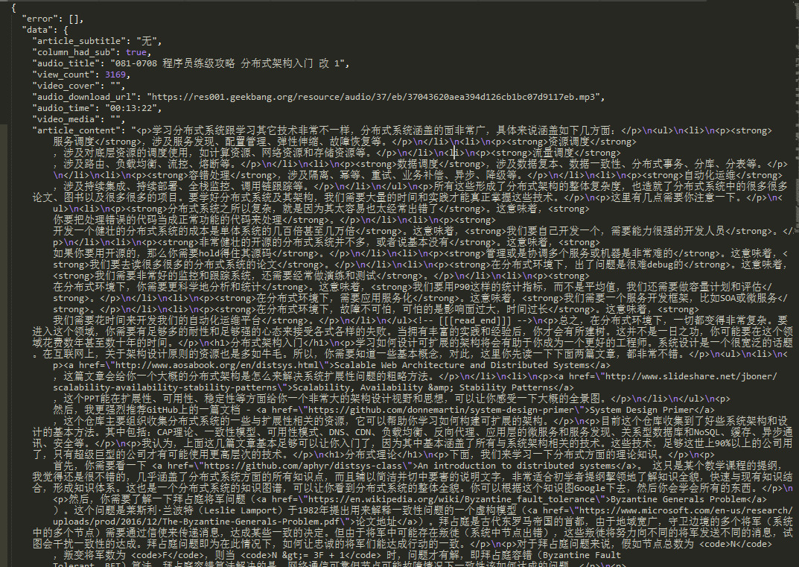
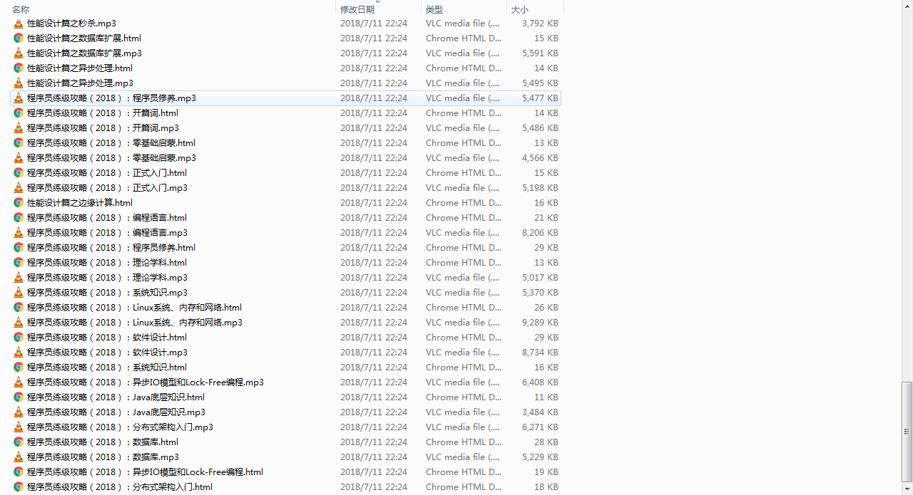

##起因
极客时间特别不友好，付费购买后只能在移动端查看，我想PC端边做笔记边看，但是达不到，所以就自己动手把自己已购买的专栏爬下来，保存为html，音频保存为mp3，方便自己查看。

##怎么做
利用findler抓包，手机端设置代理，可以看到是通过cookie形式传递，所以我们要做的就是记录他的url，记录自己的cookie，然后coding。

##技术栈
java + okhttp + gson

##Example
抓取陈皓的专栏，首先获取他的专栏id，抓包分析是48，然后取得所有article的id，然后进行每个篇文章的抓包，api还是比较友好的，都是json，article的内容都是html的，所以效果如下：

然后自己封装一下html就ok，保存本地，方便查看。

最终结果如下：

大家要支持正版，耗子哥写文章不容易，只怪geektime不提供便利。